# How we access blockchain data

Show how **summary.dev** gives access to blockchain data with SQL and
GraphQL and builds charts and dashboards.

## Packaging options

We see three ways we can package our query tool:

- **cli**: one executable file with no dependencies
- **GUI** app based on an open source Rill: sql editor and charts
- **browser**: DuckDb can compile into wasm and load into a web page or a 
  browser extension

## Using the browser

We can compile DuckDb into **wasm** and run queries in the browser. A
web page loaded in the browser hosts the sql editor. The queries are
executed using local compute resources over a subset of data hosted on a
web server. To the end user the experience is similar to using a web
interface in a typical client-server setup, and may be preferred to
installing and running a cli.

The only drawback is inability to download the data files locally. This
is the limitation of the browser that may be overcome in the future;
another options is a browser extension which has access to local disk
and can download and store files.

## Command line

CLI query tool provides a quick way to query blockchain data with SQL.
It can query parquet files on a remote server and on the local disk, and
query tables in the local database.

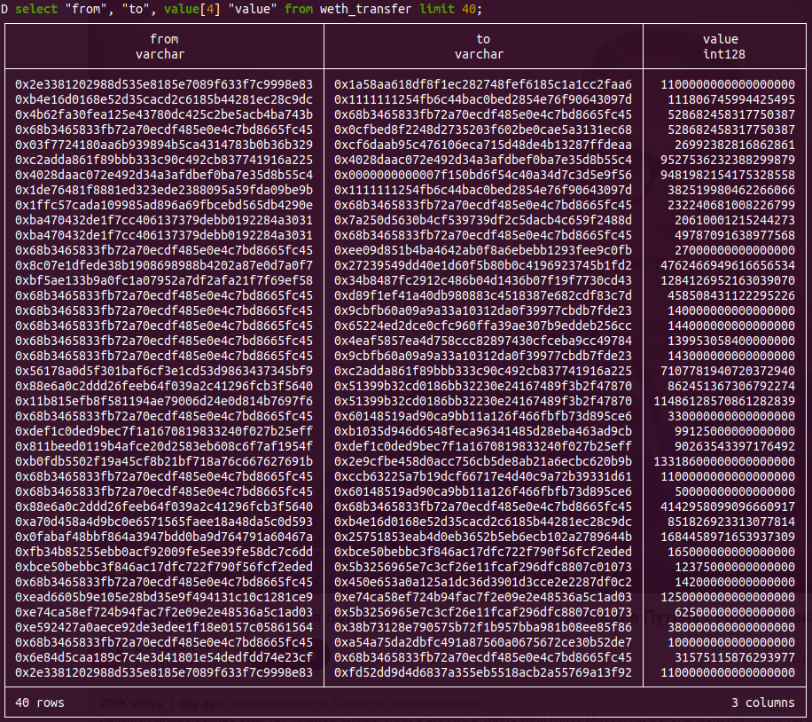

## Rill

CLI query tool provides a quick way to query blockchain data with SQL.
It can query parquet files on a remote server and on the local disk, and
query tables in the local database.

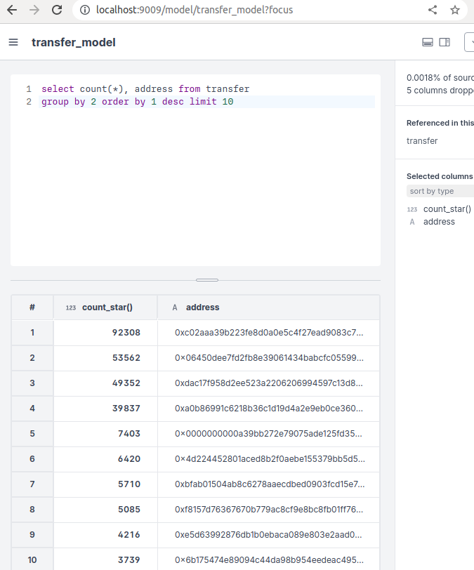

## SQL Editor

We open access to blockchain data via popular Business Intelligence
tools like Redash with a convenient SQL Editor.

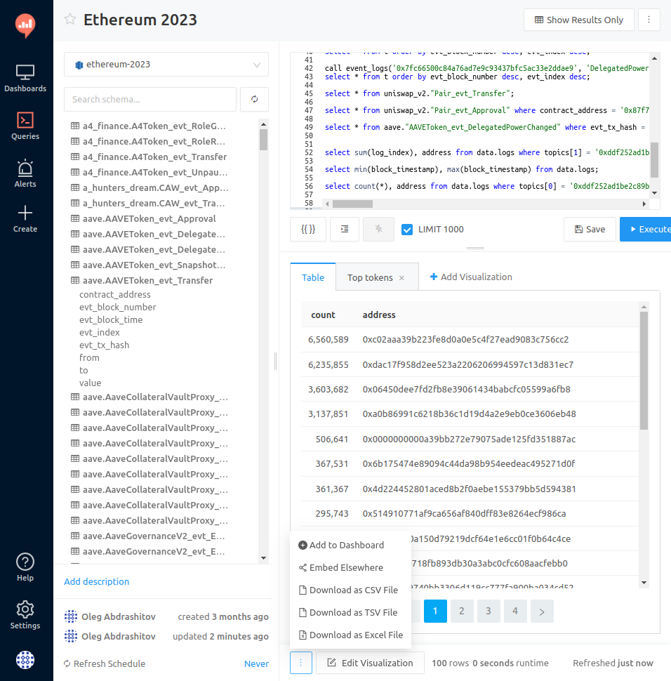

## Query via API

Access query results via an http call by your script or app.

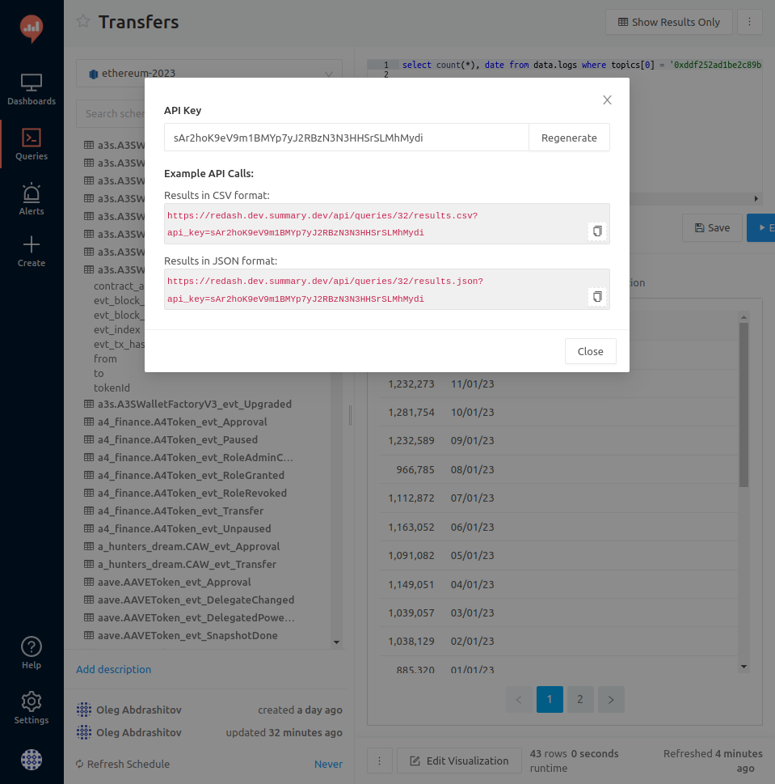

## Query results from the API

Response is in json or csv.

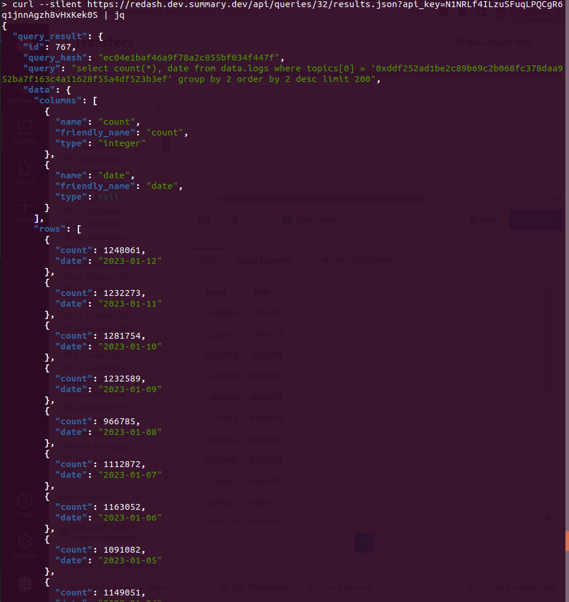

## Charts

Build charts from query results.

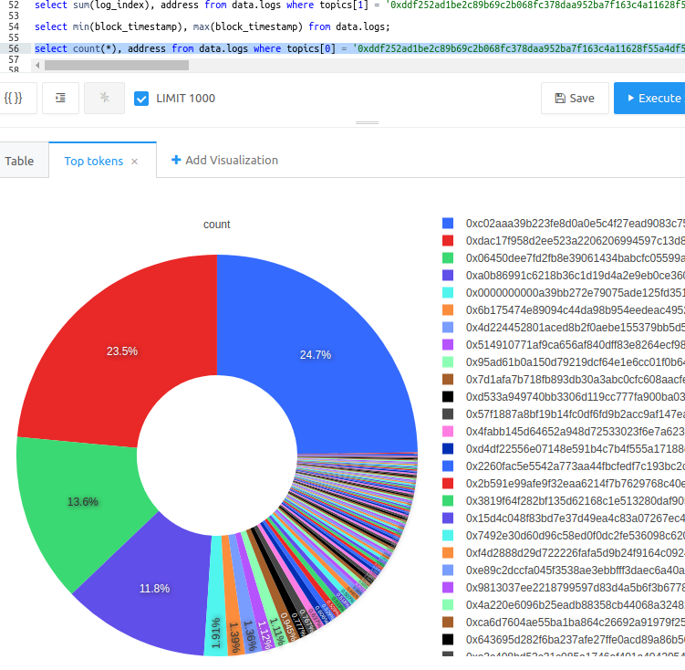

## Dashboards

Build dashboards from charts.

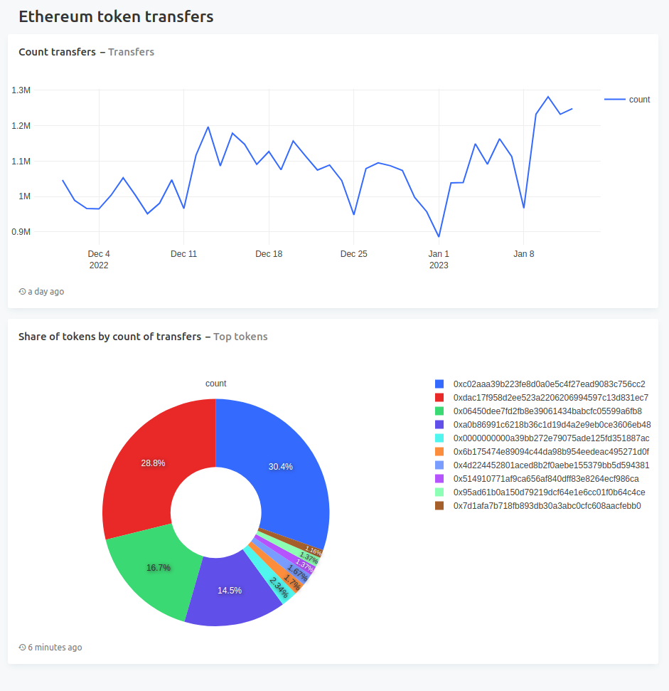

## GraphQL

Query events with GraphQL from a web interface.

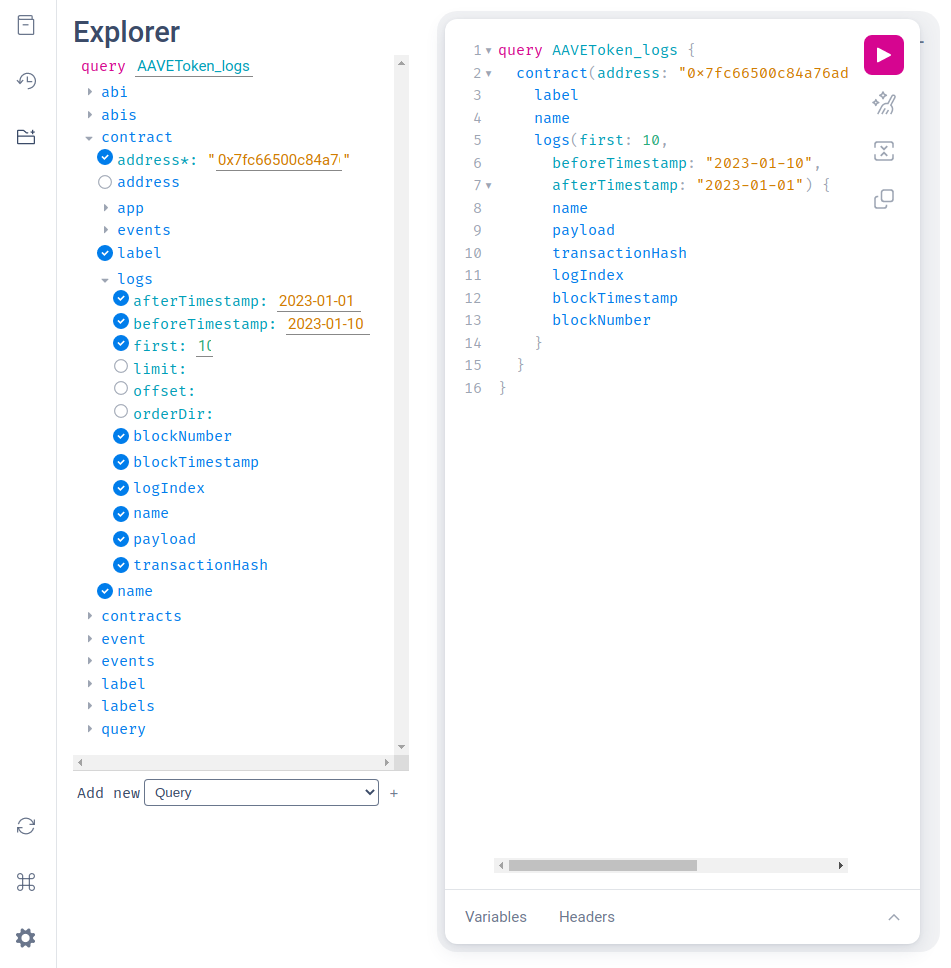

## GraphQL response

GraphQL response comes in json and contains the same data as in the
response from a SQL query with the same filter.

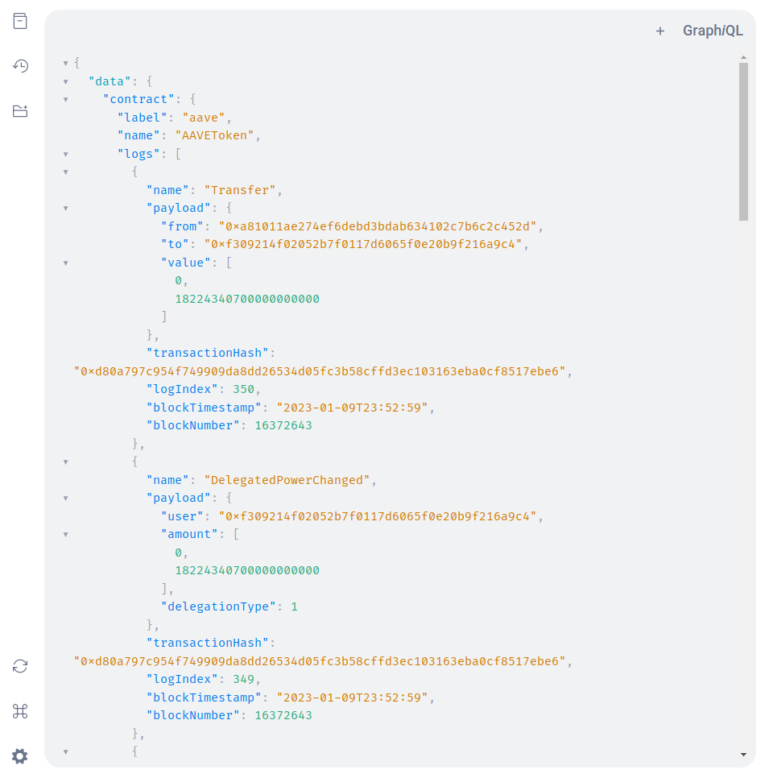

## GraphQL via http

GraphQL queries can be sent via an http post by your script or app.

```bash
curl 'https://graphile-ethereum.dev.summary.dev/graphql' 
-H 'content-type: application/json' 
--data-raw '{"query":"query AAVEToken_logs { 
contract(address: \"0x7fc66500c84a76ad7e9c93437bfc5ac33e2ddae9\") 
{ label name 
logs(first: 10, 
beforeTimestamp: \"2023-01-10\", 
afterTimestamp: \"2023-01-01\") 
{ name payload transactionHash logIndex blockTimestamp blockNumber } } }",
"operationName":"AAVEToken_logs"}'
```

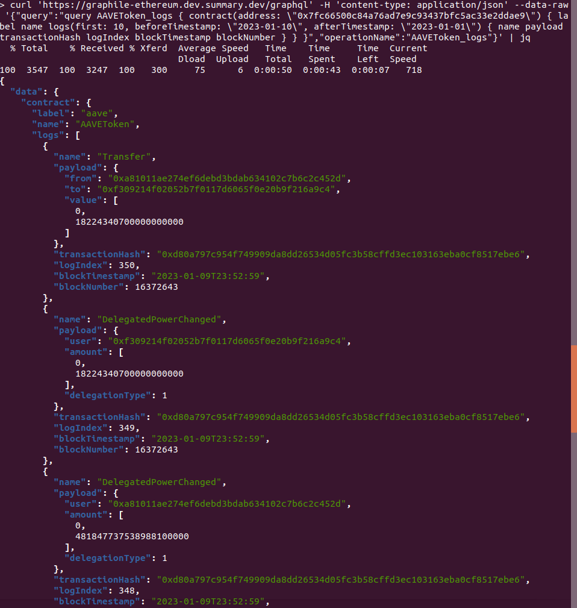

## Explore event definitions with GraphQL

Query with GraphQL for labels, contracts and event definitions with a
tree explorer.

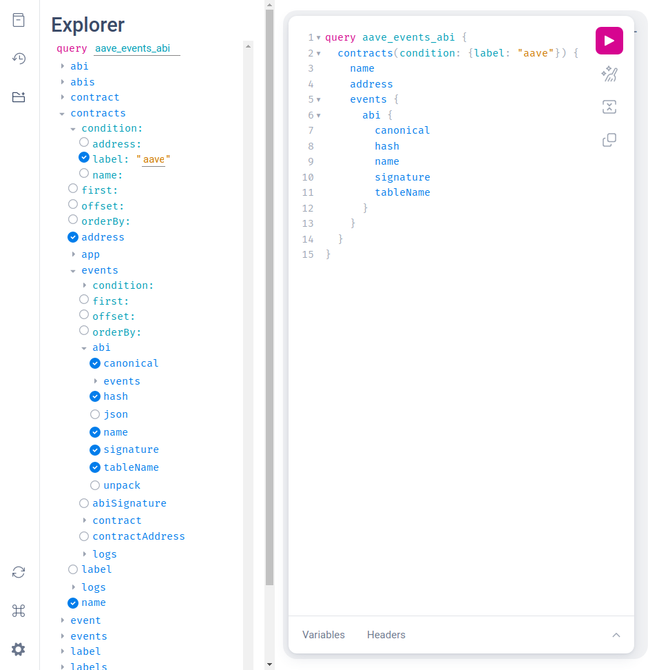

## Event definitions response

Discover events, their signatures and ABI definitions.

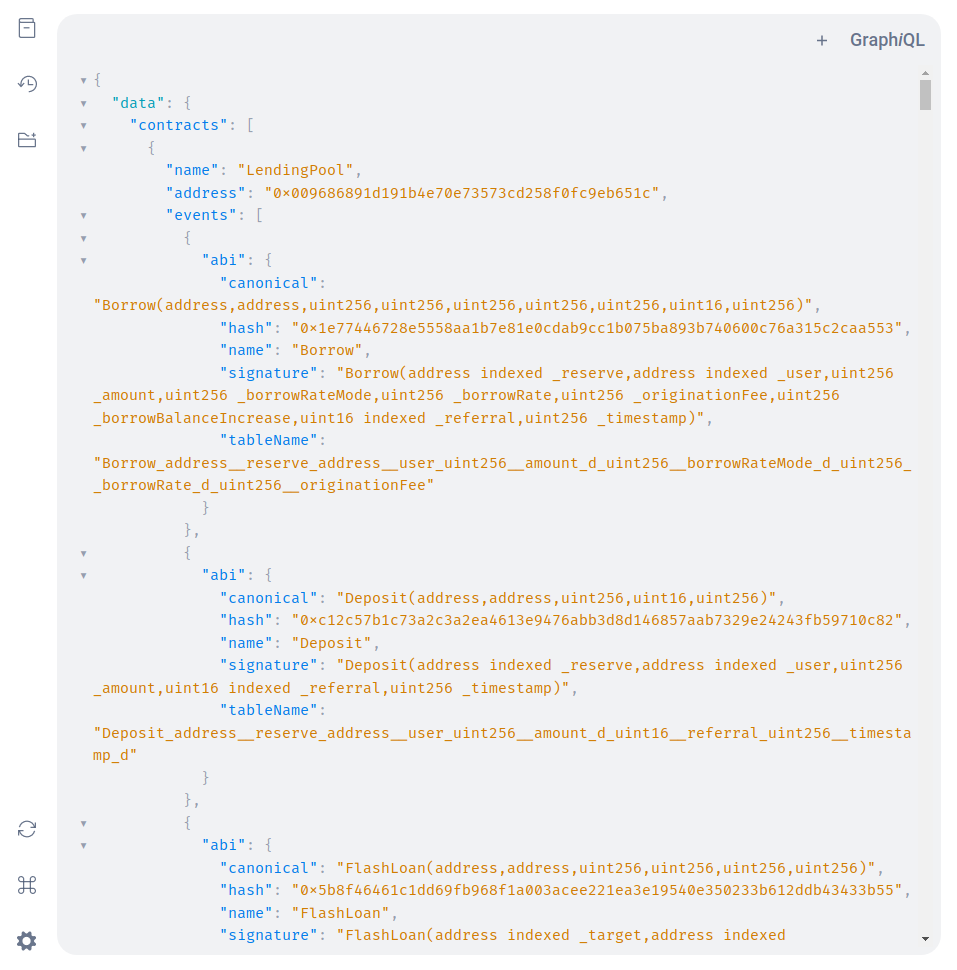
